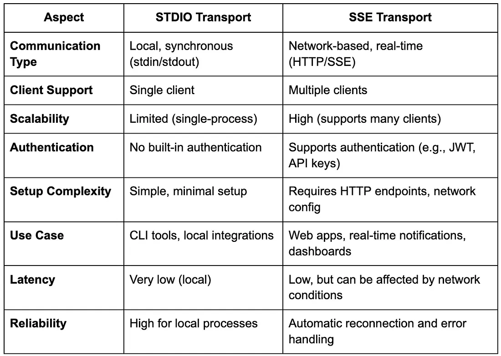

# python-mcp
Learning by code

# MCP Architecture Overview
The Model Context Protocol follows a client-host-server architecture: This separation of concerns allows for modular, composable systems where each server can focus on a specific domain (like file access, web search, or database operations).

MCP Hosts: Programs like Claude Desktop, IDEs, or your python application that want to access data through MCP
MCP Clients: Protocol clients that maintain 1:1 connections with servers
MCP Servers: Lightweight programs that each expose specific capabilities through the standardized Model Context Protocol (tools, resources, prompts)
Local Data Sources: Your computer's files, databases, and services that MCP servers can securely access
Remote Services: External systems available over the internet (e.g., through APIs) that MCP servers can connect to
This separation of concerns allows for modular, composable systems where each server can focus on a specific domain (like file access, web search, or database operations).

MCP defines three core primitives that servers can implement:

Tools: Model-controlled functions that LLMs can invoke (like API calls, computations)
Resources: Application-controlled data that provides context (like file contents, database records)
Prompts: User-controlled templates for LLM interactions
For Python developers, the most immediately useful primitive is tools, which allow LLMs to perform actions programmatically.

# Transport Mechanisms Deep Dive
MCP supports three main transport mechanisms:

# Stdio (Standard IO):
Communication occurs over standard input/output streams
Best for local integrations when the server and client are on the same machine
Simple setup with no network configuration required

# SSE (Server-Sent Events):
Uses HTTP for client-to-server communication and SSE for server-to-client
Suitable for remote connections across networks
Allows for distributed architectures

# Streamable HTTP:
Modern HTTP-based streaming transport that supersedes SSE
Uses a unified endpoint for bidirectional communication
Recommended for production deployments due to better performance and scalability
Supports both stateful and stateless operation modes
Understanding when to use each transport is crucial for building effective MCP implementations:

Use Stdio when building single-application integrations or during development
Use SSE for development or when working with older MCP implementations
Use Streamable HTTP for production deployments where you need the best performance and scalability

